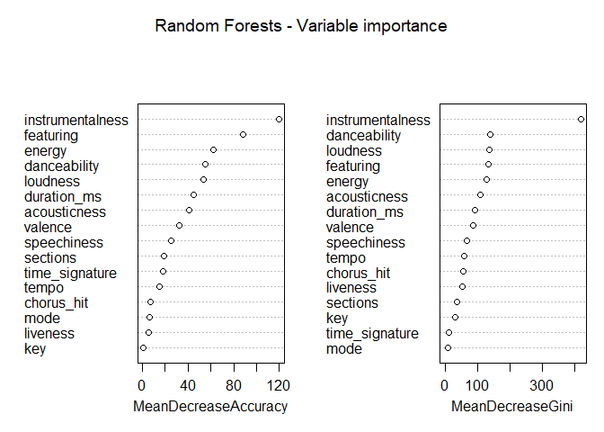

THE HIT SONG PREDICTOR
================
Marta Fattorel & Fabio Taddei Dalla Torre

``` r
library(tree)
library(ISLR)
library(ggpubr)
library(ggplot2)
library(glmnet)
library(MASS)
library(randomForest)
library(e1071)
library(gbm)
library(caret)
library(dplyr)
library(reshape2)
library(scales)
library(pheatmap)
```

<style>
body {
text-align: justify}
</style>

## INTRODUCTION

Our work is inspired by the so called *Hit Song Science*, whose pioneer
is the music entrepreneur Mike McCready. The Hit Song Science aims at
predicting whether a song will be a hit before its distribution, by
analyzing its audio features through machine learning algorithms.
Therefore, our main research question is: *‘Can we accurately predict
whether a song will be a hit knowing some of its audio features?’* To
answer this question we have applied some of the most relevant
statistical learning models for classification on the dataset available
at
[link](https://www.kaggle.com/theoverman/the-spotify-hit-predictor-dataset).

## DATA EXPLORATION

We decided to consider the most recent data available, which is the
dataset for the 10s. After having removed the duplicates, added and
removed features, our dataset consists of 6258 songs (realized between
2010 and 2019) and 19 features. The audio features were extracted
through the Spotify Web API, while the *hit*/*flop* categorization
(respectively encoded as 1 and 0), is based on the Billboard Hot 100
hits \[1\]. In addition, it is possible to see that many songs are
composed in collaboration (featuring) with other artists and we thought
that this information could give a meaningful contribution to our
analysis. Hence, we decided to create a new column *featuring* that
encodes whether the song has been featured (1) or not (0).

``` r
dataset <- read.csv("dataset-of-10s.csv", header = TRUE)
# summary(dataset)
```

``` r
# Add "featuring" variable
dataset$artist <- as.character(dataset$artist)
featuring <-  strsplit(dataset$artist,"Featuring")
dataset$featuring <- sapply(featuring, "[", 2 )
dataset$featuring <- as.factor(ifelse(is.na(dataset$featuring), 0, 1))
```

``` r
# sapply(dataset, function(x) sum(is.na(x)))                       # no NA values
dataset <- dataset[!duplicated(dataset[, c('track', 'artist')]), ] # remove duplicates
options(scipen = 999)                                              # turn off scientific notation
dataset <- within(dataset, rm('uri'))                              # drop uri
dataset$target <- factor(dataset$target)                           # target into factor
```

Before fitting the models, it is useful to explore the variables
distribution. Since the main scope of the project is to estimate whether
a song has the potential to become a hit or not depending on some
variables, it would be interesting to have an overview on the
distribution of those features according to the songs success.

``` r
# create a new dataset with labels for target and featuring for better visualization
df.labels <- dataset[, 3:19]
df.labels$target <- ifelse(df.labels$target == 1, 'Hit', 'Flop')
df.labels$featuring <- ifelse(df.labels$featuring == 1, 'Yes', 'No')
df.labels$target <- factor(df.labels$target)
df.labels$featuring <- factor(df.labels$featuring)
```

``` r
theme_set(theme_classic())
plot.songs <- function(x) {
  features <- names(x)
  for (i in seq_along(features)) {
 assign(paste("g", i, sep = ""),ggplot(x,aes_string(x = features[i])) + geom_density(aes(color = target)) + theme(legend.title = element_blank())) }
  g16 <- ggplot(df.labels, aes(x = featuring)) + geom_bar(aes(fill = target))
  print(ggarrange(g1, g2, g3, g4, g5, g6, g7, g8, g9, ncol = 3, nrow = 3, common.legend = T))
  print(ggarrange(g10, g11, g12, g13, g14, g15, g16, ncol = 3, nrow = 3, legend = FALSE))
  
}
plot.songs(df.labels)
```

<!-- --><!-- -->

The major differences in the distribution can be seen considering the
variables *danceability*, *energy*, *valence*, *featuring* and
*instrumentalness*. In addition, given the particular shape of
*instrumentalness*, it would be interesting to plot an histogram to
further explore the distribution of the variable according to the
target.

``` r
ggplot() + 
  geom_histogram(data = df.labels[df.labels$target == "Flop",], 
                 aes(x=instrumentalness, fill="f"), bins = 30, alpha=0.5) +
  geom_histogram(data = df.labels[df.labels$target == "Hit",], 
                 aes(x=instrumentalness, fill="h"), bins = 30, alpha=0.5) +
  labs(title="Instrumentalness in hit and flop songs") +
  scale_colour_manual(name="Type of song", values=c("f" = "#F8766D","h" = "#00BFC4"), labels=c("f"= "Flop","h"="Hit")) + 
  scale_fill_manual(name="Type of song",values=c("f"="#F8766D","h" =  "#00BFC4"),labels=c("f"="Flop","h"= "Hit"))
```

<!-- -->

From this plot we can see that all hit songs have a level of
instrumentalness equal to 0 or close to it, while only flop songs show
values close to 1 even if the majority of them result to be close to 0
as well.

Furthermore, we can visualize with a heatmap the correlation among the
numerical features of our dataset. We notice that, the majority of them
are independent, while few of them are positively correlated such as
*energy* and *loudness* or negatively correlated like *energy* and
*acousticness*.

``` r
pheatmap(cor(as.matrix(dataset[, 3:17])), cell.width = 10, cell.height = 10, cluster_rows = F, cluster_cols = F) 
```

<!-- -->

## STATISTICAL LEARNING MODELS

In this section we are going to fit several statistical models in order
to find the best technique(s), meaning the one(s) that minimize(s) the
test error rate, and thus give a more accurate hit prediction. As shown
before, we have 15 numerical predictors plus a categorical one
(featuring) and a binary categorical response variable. Therefore, we
are going to address a classification problem.

### LOGISTIC REGRESSION

The logistic regression models the probability for a song of being a
*hit* or a *flop* given the 16 predictors.

``` r
glm.fit <- glm(target ~.,  family = binomial, data = dataset[, 3:19])
summary(glm.fit)
```

    ## 
    ## Call:
    ## glm(formula = target ~ ., family = binomial, data = dataset[, 
    ##     3:19])
    ## 
    ## Deviance Residuals: 
    ##     Min       1Q   Median       3Q      Max  
    ## -2.5816  -0.5765   0.0001   0.7649   4.1997  
    ## 
    ## Coefficients:
    ##                        Estimate     Std. Error z value             Pr(>|z|)    
    ## (Intercept)        3.7140427278   0.6398476968   5.805   0.0000000064530204 ***
    ## danceability       2.6518574761   0.2815666181   9.418 < 0.0000000000000002 ***
    ## energy            -5.4411676545   0.3495746121 -15.565 < 0.0000000000000002 ***
    ## key                0.0061970866   0.0098098562   0.632             0.527570    
    ## loudness           0.3356359496   0.0212710630  15.779 < 0.0000000000000002 ***
    ## mode               0.2583738760   0.0765377153   3.376             0.000736 ***
    ## speechiness       -1.4059489939   0.3836229755  -3.665             0.000247 ***
    ## acousticness      -1.5117513453   0.1978122573  -7.642   0.0000000000000213 ***
    ## instrumentalness  -7.6459670646   0.6261709009 -12.211 < 0.0000000000000002 ***
    ## liveness          -0.4795508272   0.2229370146  -2.151             0.031471 *  
    ## valence           -0.4363877711   0.1845808653  -2.364             0.018069 *  
    ## tempo              0.0040899429   0.0012392931   3.300             0.000966 ***
    ## duration_ms       -0.0000026213   0.0000009845  -2.662             0.007756 ** 
    ## time_signature     0.4995471643   0.1181708796   4.227   0.0000236481965030 ***
    ## chorus_hit        -0.0025747790   0.0021385792  -1.204             0.228602    
    ## sections          -0.0278686927   0.0203775704  -1.368             0.171432    
    ## featuring1        18.4970151727 196.6408255782   0.094             0.925058    
    ## ---
    ## Signif. codes:  0 '***' 0.001 '**' 0.01 '*' 0.05 '.' 0.1 ' ' 1
    ## 
    ## (Dispersion parameter for binomial family taken to be 1)
    ## 
    ##     Null deviance: 8672.3  on 6257  degrees of freedom
    ## Residual deviance: 4781.1  on 6241  degrees of freedom
    ## AIC: 4815.1
    ## 
    ## Number of Fisher Scoring iterations: 17

Looking at the p-value score, it appears that some predictors do not
show clear evidence of a real association with the response variable.
Therefore, we can compare the performance of the full logistic
regression with the one of a regularization model. We move on by fitting
the full logistic regression on our dataset. However, since the accuracy
of a statistical model is given by the error on unseen data, we perform
cross-validation to estimate its performance. In particular, we start
with the **Validation Set approach** according to which we randomly
split the dataset into two equally sized parts (train and test), we fit
the model on the train set to predict the test error rate on the test
data. Furthermore, since we know that this approach has some limitations
such as the high dependence of the test error on the sets choice, we
also perform **5-fold cross validation** to compare the results.

``` r
set.seed(10)

train <- sample(nrow(dataset), nrow(dataset)/2)

full.lr <- glm(target ~.,  family = binomial, subset = train, data = dataset[, 3:19])
lr.prob <- predict(full.lr, newdata = dataset[-train,], type = 'response')
lr.pred <- rep(0, length(lr.prob))
lr.pred[lr.prob >= 0.5] <- 1                     
# table(lr.pred, dataset$target[-train]) confusion matrix        
full.err <- with(dataset, mean(lr.pred != target[-train]))

set.seed(10)

f <- 5
shuffled.data <- dataset[sample(nrow(dataset)),]
folds <- cut(seq(1, nrow(dataset)), breaks = f, labels=FALSE)
cv.errors <- rep(0, f)
for(i in 1:f){
  train <- which(folds != i, arr.ind = TRUE)
  full.lr <- glm(target ~., family = binomial, subset = train, data = shuffled.data[, 3:19])
  class <- ifelse(predict(full.lr, shuffled.data[-train,], type = 'response') >= 0.50, 1,0)
  # fold.error <- with(shuffled.data, mean(class != target[-train]))
  fold.error<- ifelse(class != shuffled.data[-train, ]$target, 1, 0)
  cv.errors[i] <- mean(fold.error)
}
cv.full <- mean(cv.errors)

cat("Full logistic regression test error with Validation Set is:", full.err, "\n")
```

    ## Full logistic regression test error with Validation Set is: 0.177373

``` r
cat("Full logistic regression test error with 5-fold CV is:", cv.full, "\n")
```

    ## Full logistic regression test error with 5-fold CV is: 0.1818475

As we mentioned before, we can compare the full logistic regression
model with a regularization method in order to see which are the most
relevant predictors. We choose **Lasso penalized logistic regression**.
This model keeps all the predictors, but a penalty is imposed to the
logistic model for having too many variables. Furthermore, Lasso
regression does also feature selection insofar it forces some less
contributive predictors to be exactly 0. Before fitting the model, we
can perform cross-validation to tune the hyperparameter `lambda`, which
determines the amount of coefficient shrinkage. Afterwards, we fit the
logistic model on the train set and make predictions on the test data.
Finally, we refit our lasso model on the full dataset with `lambda`
chosen by cross-validation and examine the coefficient estimates. We
notice that some coefficients are really close to 0, but none of them is
exactly 0.

``` r
set.seed(10)

x <- model.matrix(target ~., dataset[, 3:19])[, -1] # matrix of predictor variables
y <- dataset$target                                 # response variable

# Find the optimal lambda through cross-validation
cv.lasso <- cv.glmnet(x[train, ], y[train], alpha = 1, family = "binomial") 

lr.lasso <- glmnet(x[train, ], y[train], family = 'binomial', alpha = 1, lambda = cv.lasso$lambda.min)
lasso.prob <- predict(lr.lasso, newx = x[-train,], type = 'response') 
pred.classes <- ifelse(lasso.prob > 0.5, 1, 0)
lasso.err <- mean(pred.classes != y[-train])
cat("Lasso logistic regression test error is:", lasso.err, "\n")
```

    ## Lasso logistic regression test error is: 0.1821086

``` r
log.lasso <- glmnet(x, y, family = 'binomial', alpha = 1)
predict(log.lasso, type = 'coefficients', s = cv.lasso$lambda.min)[1:17, ]
```

    ##      (Intercept)     danceability           energy              key 
    ##   3.685464023812   2.639116925924  -5.394873997611   0.005765596861 
    ##         loudness             mode      speechiness     acousticness 
    ##   0.333111097902   0.255137915668  -1.388532318930  -1.493746091230 
    ## instrumentalness         liveness          valence            tempo 
    ##  -7.491582432989  -0.471494736322  -0.426516580729   0.004014805082 
    ##      duration_ms   time_signature       chorus_hit         sections 
    ##  -0.000002638631   0.493516188157  -0.002479385969  -0.026635227786 
    ##       featuring1 
    ##   7.763622646340

As a result, we notice that the performance of the two models fitted so
far is extremely close to one another (test error around 0.18). Thus,
even though Lasso penalizes some less relevant coefficients, the overall
performance is not compromised.

### SUPPORT VECTOR MACHINES

Unlike logistic regression, which models the probability of being in a
certain class, Support Vector Machines classify observations depending
on which side of the hyperplane (the hyperplane divides the
p-dimensional space into two halves) they lie. If our data had linear
class boundaries, we would have fitted a Support Vector Classifier with
a linear kernel. However, we found that the best performance is obtained
by fitting a Support Vector Machine with a radial kernel. Furthermore,
before fitting the model, in order to improve the final prediction, we
can tune the hyperparameters `cost`, which estimates the magnitude of
the hyperplane violations allowed and `gamma`, which is a penalization
term for big distances. This is done by the `tune()` function, which
performs a 10-fold CV and chooses the best values among the given ones.
We tried with `cost=c(0.001, 0.01, 0.1, 1, 5, 10, 100)` and
`gamma=c(0.01, 0.1, 1, 4)`. However, here we consider a limited range of
values since the process is computationally expensive.

``` r
set.seed(10)

train <- sample(nrow(dataset), nrow(dataset)/2)
dataset$target <- as.factor(dataset$target)

tune.out <- tune(svm, target ~., data = dataset[train, 3:19], kernel = "radial", ranges = list(cost = c(1, 5), gamma = c(0.1, 1)))
# summary(tune.out)
```

The optimal cost results to be 1, while the best gamma is 0.1. We now
fit our model on the train data to predict the test error rate.

``` r
best.svm <- tune.out$best.model
opt.gamma <- best.svm$gamma
opt.cost <- best.svm$cost

best.pred <- predict(best.svm, newdata = dataset[-train, 3:19])
# table(best.pred, dataset$target[-train]) confusion matrix
svm.err <- with(dataset, mean(best.pred != target[-train]))
cat("Support vector machines test error is:", svm.err, "\n")
```

    ## Support vector machines test error is: 0.1684244

### DECISION TREES

Classification trees split the feature space into regions following a
tree structure and for each region the model predicts a single value.

In order to evaluate how well a classification tree performs, we first
randomly split the dataset into two different sets, one used for fitting
the tree on our train data and the other used for validation and test
error estimation.

``` r
set.seed(1234)

# use the dataset with labels created at the beginning for better trees visualization

train <- sample(nrow(df.labels), nrow(df.labels)/2)
tree.train <- tree(target ~., subset = train, data = df.labels) 
tree.pred <- predict(tree.train, df.labels[-train,], type = "class") 

tree.err <- mean(tree.pred != df.labels$target[-train])
cat("Classification tree test error is:", tree.err, "\n")
```

    ## Classification tree test error is: 0.1946309

Now we can prune the tree to see if the performance improves, given that
pruning should reduce overfitting by reducing its size. We are going to
do so by using a cross-validation approach with the function `cv.tree()`
and the argument `FUN = prune.misclass`.

``` r
cv.song <- cv.tree(object = tree.train, FUN = prune.misclass)
cv.song
```

    ## $size
    ## [1] 7 6 5 4 2 1
    ## 
    ## $dev
    ## [1]  559  559  581  602  688 1654
    ## 
    ## $k
    ## [1] -Inf    0   21   37   45  878
    ## 
    ## $method
    ## [1] "misclass"
    ## 
    ## attr(,"class")
    ## [1] "prune"         "tree.sequence"

The output shows the cross-validation error rate (*dev*) for the
corresponding number of leaves (*size*). The best number of leaves is
represented by the one that minimizes the error rate. Hence, in this
case it is 7.

Now we build the pruned tree.

``` r
opt.size <- cv.song$size[which.min(cv.song$dev)]
prune.songs <- prune.misclass(tree.train, best = 6)
```

Plotting both the complete tree and the pruned one

``` r
par(mfrow = c(1, 2))
plot(tree.train)
text(tree.train, pretty = 0, cex = .7)
title("Classification tree")
plot(prune.songs)
text(prune.songs, pretty = 0, cex = .7)
title("Pruned tree")
```

<!-- -->

In this case we can see that the pruned tree and the initial one are the
same. Hence, we do not need to compute the test error for the pruned
one. From the plot we notice that the most important predictors of a
song success are *instrumentalness*, *featuring*, *energy* and loudness.

Unfortunately trees are known to be less accurate than other classical
methods and have high variance. In order to improve their performance,
there are methods like *Bagging*, *Boosting* and *Random Forests*. Since
Bagging is a particular case of Random Forests (when m = p) and bagged
trees are usually correlated, with this technique we are likely to not
get the best tree. Hence, we are going to perform only Boosting and
Random Forests.

**Performing Boosting**

The aim of boosting is improving the result of the model by reducing
tree variance. The method keeps using the same model, but gives
different weights to the observations.

``` r
dataset$target <- as.numeric(dataset$target)
dataset$target <- ifelse(dataset$target == 1, 0, 1) # in order to run the method we have to change the variable target into numeric
```

Before fitting the model, there are three main hyperparameters that need
to be tuned: *shrinkage*, which refers to the learning rate i.e. the
contribution of each tree on the final outcome; *tree depth*, which
controls the depth of individual trees; and *number of trees*. Since
this process is computationally expensive we have tried it with a wider
range of parameters (`learning_rate = c(0.3, 0.1, 0.05, 0.01, 0.005)`
and `interaction.depth = c(3, 5, 7, 9)`), but here we consider only some
of those for efficiency and we perform 5-fold cross validation to choose
the best ones.

``` r
# create grid  with all the values of the hyperparameters 
hyper_grid <- expand.grid(
  learning_rate = c(0.1, 0.05),
  interaction.depth = c(5, 7),
  error = NA,
  trees = NA
)

# fit the model with different parameters 
for(i in seq_len(nrow(hyper_grid))) {

  set.seed(10) # for reproducibility
    m <- gbm(
      formula = target ~ ., 
      data = dataset[train, 3:19],
      distribution = "bernoulli",
      n.trees = 300,
      shrinkage = hyper_grid$learning_rate[i], 
      interaction.depth = hyper_grid$interaction.depth[i], 
      cv.folds = 5
  )
  
  hyper_grid$error[i]  <- min(m$cv.error)
  hyper_grid$trees[i] <- which.min(m$cv.error) 
}

# results
hyper <- arrange(hyper_grid, error)
best.shrinkage <- arrange(hyper, error)[1, 1]
best.depth <- arrange(hyper, error)[1, 2]
best.tree <- arrange(hyper, error)[1, 4]

hyper[1, ]
```

    ##   learning_rate interaction.depth     error trees
    ## 1          0.05                 7 0.6707738   222

After tuning, the best hyperparameters resulted to be:
`interaction.depth = 7`, `shrinkage = 0.05`, `n.trees = 222`. Now we can
fit the model with these hyperparameters and predict the test error
rate.

``` r
cat("Boosted tree test error is:", test.boost, "\n")
```

    ## Boosted tree test error is: 0.1537232

``` r
data$rel.inf <- round(data$rel.inf,2)
data["Variables"] <- factor(row.names(data), levels = row.names(data))

ggplot(data, aes(x = rel.inf, y = Variables, label = rel.inf)) +
  geom_col(position = 'dodge', fill="royalblue3", width = .5) +
  geom_text(position = position_stack(vjust = 1.05),
            vjust = -0.5,
            size = 3) +
  scale_y_discrete(limits = rev(levels(data$Variables))) +
  coord_cartesian(xlim = c(0, 100)) +
  labs(title="Predictors relative influence calculated by boosting",
       x = "Relative influence",
       y= NULL) +
  theme_minimal()+
  theme(panel.grid.major.y = element_blank())
```

<!-- -->

The output shows the relative influence given to the different
predictors. It is interesting to notice that the predictors with the
highest relative influence are the ones that show the most diverse
distribution according to the song success in our data exploration
density plots at the beginning of this report. In particular, we notice
that *instrumentalness* is considered the most relevant predictor and
the value of its influence differs a lot compared to all the other
predictors. Moreover, it is possible to notice that the boosting method
has provided a relevant improvement on the test error: from ≅ 0.20 with
the first classification tree, to ≅ 0.15 with the boosted tree.

``` r
dataset$target <- as.factor(dataset$target) # changing back target to factor
```

**Performing Random Forests**

The aim of Random Forests is again improving the prediction accuracy. In
this case the method works by adding another layer of randomness to
prevent correlation among trees. Before each split `m` features
(hyperparameter `mtry` in `randomForest()` function) are chosen at
random from the `p` available, and splits are taken only by considering
these variables. Before fitting the model, we tune the hyperparameters
`mtry` and `ntree` which refers to the number of trees.

``` r
set.seed(10)

# Tune mtry with 5-fold cross validation
trControl <- trainControl(method = "cv", number = 5, search = "grid")

tuneGrid <- expand.grid(.mtry = c(1:8))
rf <- train(target ~ ., data = dataset[train, 3:19], method = "rf", metric = "Accuracy", tuneGrid = tuneGrid, importance = T, ntree = 100, trControl = trControl)

opt.mtry <- rf$bestTune$mtry
```

To tune `ntree` we tried with `c(250, 300, 500, 800, 1000)`. Here, to
reduce the complexity we give the algorithm just two of these values.

``` r
set.seed(10)

# Tune ntrees with 5-fold cross validation
trControl <- trainControl(method = "cv", number = 5, search = "grid")
store_maxtrees <- list()


tuneGrid <- expand.grid(.mtry = opt.mtry) 
for (ntree in c(500, 800)){
  rf_maxtrees <- train(target ~ ., data = dataset[train, 3:19], 
              method = "rf", metric = "Accuracy", 
              tuneGrid = tuneGrid, importance = T, 
              ntree = ntree, trControl = trControl)
  key <- toString(ntree)
  store_maxtrees[[key]] <- rf_maxtrees
}

results_tree <- resamples(store_maxtrees)
#summary(results_tree) 
```

We now fit the Random Forests model on the train data with the best mtry
obtained which is 4 and the optimal number of trees, 800. In this case
we do not need to compute the test error with CV, instead we can look at
the OOB classification error to estimate it. Indeed, for any
observation, the OOB predicts the response using all models that do not
include that observation.

``` r
rf.train <- randomForest(target ~ ., data = dataset[, 3:19], subset = train, mtry = opt.mtry, importance = TRUE, ntree = 800) 

rf.OOB <- rf.train$err.rate[nrow(rf.train$err.rate), 1]
cat("Random Forests test error is:", rf.OOB, "\n")
```

    ## Random Forests test error is: 0.1473314

``` r
varImpPlot(rf.train, main = "Random Forests - Variable importance")
```

<!-- -->

``` r
rf.train
```

    ## 
    ## Call:
    ##  randomForest(formula = target ~ ., data = dataset[, 3:19], mtry = opt.mtry,      importance = TRUE, ntree = 800, subset = train) 
    ##                Type of random forest: classification
    ##                      Number of trees: 800
    ## No. of variables tried at each split: 4
    ## 
    ##         OOB estimate of  error rate: 14.73%
    ## Confusion matrix:
    ##      0    1 class.error
    ## 0 1284  283   0.1805999
    ## 1  178 1384   0.1139565

From the output of the Random Forests we can see that the OOB error is
slightly higher than the test error estimated with boosting.
Nevertheless, Random Forests provide a considerable test error reduction
compared to the simple tree classifier. Moreover, the Global Variable
Importance measured by the Mean Decrease Accuracy shows that the most
important Random Forests predictors, which are *instrumentalness*,
*featuring* and *energy* are similar to the ones calculated with
boosting. Mean Decrease in Gini index measures the importance of a
variable as well and even here the most important variable is
*instrumentalness* while other predictors are closer to each other.

## RESULTS AND FINAL CONSIDERATIONS

In order to answer the initial research question *‘Can we accurately
predict whether a song will be a hit knowing some of its audio
features?’* we fitted several statistical models on our dataset.  
To recap our analysis, we started with a Logistic Regression model and
we compared it with Lasso logistic regression. After Cross Validation
(Set Validation and 5-fold Cross Validation), to compare the test
errors, we realized that the overall performance of the initial model
was not compromised by the coefficient penalization imposed by Lasso.
However, in our case we noticed that Lasso does not perform a real
features selection insofar no coefficients resulted to be exactly 0. We
moved on by fitting a Support Vector Machine on our train data and,
after hyperparameter tuning, the model appeared to slightly outperform
the previous ones. Lastly, we applied tree based methods. In general,
classification trees tend to be not so accurate and indeed we noticed
that the test error was slightly bigger than the ones computed with the
previous methods. In order to increase the accuracy of our
classification tree, we implemented Boosting and Random Forests and we
noticed that with both techniques there was a relevant performance
improvement.

Thus, we can state that the statistical models we have implemented
return a quite accurate prediction on whether a song will be a hit or
not. In fact, as can be seen from the barplot below, which displays the
results of our analysis, the test errors oscillate between 15% and 20%.
The simple classification tree appears to be the less accurate method,
but at the same time if we apply boosting and random forests algorithms
to reduce its variance, the obtained tree results to be the most
accurate compared to all the other considered methods.

In addition, our analysis also provides an estimate of the most relevant
audio features that influence a song success. Lasso showed that no
predictors are completely irrelevant, but *duration\_ms*, *tempo*,
*key*, and *chorus\_hit* are the least significant. Almost on the same
page was the relative importance of the different variables given by the
Boosting and Random Forests methods that show how *instrumentalness*,
*featuring*, *energy*, *loudness* and *danceability* are the most
relevant song success predictors.  
To be more precise, by looking at the value of their coefficients and at
the decision trees, it is possible to build a hit song prototype. The
ideal hit song should have a low level of instrumentalness i.e. it
should have more spoken words than just sounds. Furthermore, having a
featuring is a really good predictor of song success. Moreover, the
energy of the track should be low, meaning that the song should not be
too fast or noisy; but at the same time loudness is positively
correlated with success. Finally, in line with what we expect from a hit
song, it should have a high level of danceability i.e. suitable for
dancing.

``` r
model <- c("Simple Tree","Lasso log. reg.", "Full log. reg.", "SVM", "Random Forests", "Boosted Tree")
test.error <- c(tree.err, lasso.err, cv.full, svm.err,  rf.OOB, test.boost)
test.error <- round(test.error, digits = 3)
performances <- data.frame(model, test.error)
performances$model <- factor(performances$model, levels = performances$model)

theme_set(theme_classic())
ggplot(performances, aes(x=model, y=test.error, label = scales::percent(test.error))) +
  geom_col(position = 'dodge', fill="royalblue3", width = .5) + 
  geom_text(position = position_dodge(width = .9),    
            vjust = -0.5,
            size = 3) +
  scale_y_continuous(labels = function(x) paste0(x * 100, '%')) +
  coord_cartesian(ylim = c(0,1)) +
  labs(title="Test error according to each algorithm", 
       y=NULL,
       x=NULL) +
  theme_minimal()+
  theme(panel.grid.major.x = element_blank()) +
  theme(axis.text.x = element_text(angle = 65, vjust=0.5, size = 8))
```

<!-- -->

1.  To have more information about each feature see:
    <https://developer.spotify.com/documentation/web-api/reference/tracks/get-audio-features/>
    and
    <https://www.kaggle.com/theoverman/the-spotify-hit-predictor-dataset>
